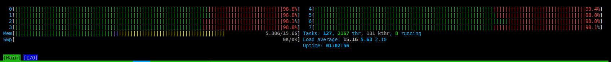
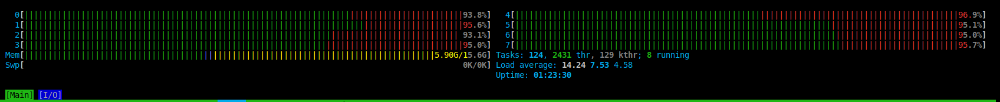
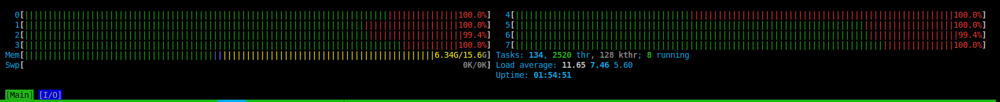
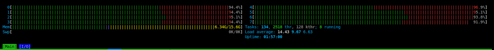
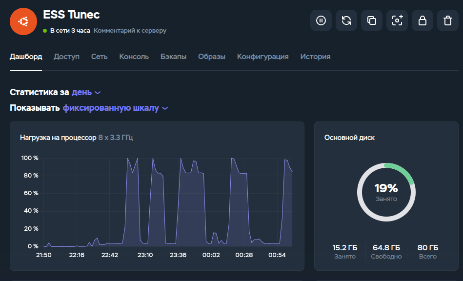
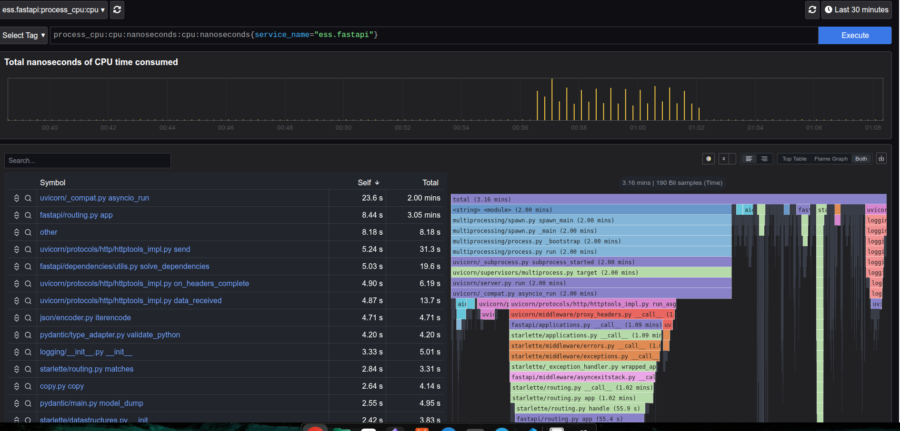
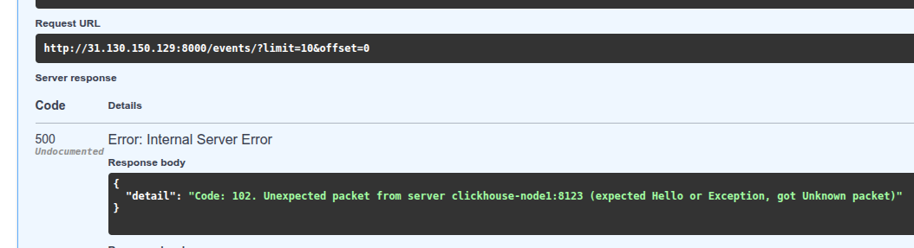
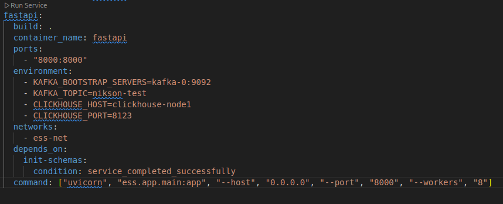

## 🔧 Общая архитектура

Система построена по **event-driven паттерну** с разделением на ингест, брокеризацию и хранение:

```
[ k6 / Client ]
       ↓ (HTTP)
[ nginx ] → балансировщик запросов
       ↓
[ FastAPI x3 ] → 3 реплики, 8 воркеров на инстанс (8 ядер CPU)
       ↓ (KafkaProducer) - синхронный драйвер (kafka-python)
[ Apache Kafka ] → 3-нодовый кластер в KRaft-режиме
       ↓ (KafkaConsumer)
[ ClickHouse ] → 4-нодовый кластер (реплицированная, без дистрибутивной таблицы и шардирования)
```

## 📦 Компоненты и конфигурация

| Компонент | Версия / Конфигурация | Примечания |
|----------|------------------------|-----------|
| **FastAPI** | Python 3.10, Uvicorn | `--workers 8`, без `flush()` в Kafka |
| **Kafka** | `apache/kafka:3.7.0`, KRaft | Топик `nikson-test`: 12 партиций, `replication_factor=3`, `min.insync.replicas=2` |
| **ClickHouse** | `clickhouse/clickhouse-server:23` | Таблица `example.events` (MergeTree, партиционирование по месяцу) |
| **Nginx** | `nginx:alpine` | Round-robin балансировка между 3 репликами FastAPI |
| **Pyroscope** | `grafana/pyroscope:latest` | Профилирование CPU и memory всех компонентов |

---

## ESS ревью после нагрузочного 3500 VU

### Метрики по тестам в этой конфигурации

```bash
WARN[0210] Request Failed                                error="Post \"http://nginx:80/events/\": EOF"
WARN[0210] Request Failed                                error="Post \"http://nginx:80/events/\": read tcp 172.20.0.13:58998->172.20.0.14:80: read: connection reset by peer"
WARN[0210] Request Failed                                error="Post \"http://nginx:80/events/\": EOF"
WARN[0210] Request Failed                                error="Post \"http://nginx:80/events/\": EOF"
WARN[0210] Request Failed                                error="Post \"http://nginx:80/events/\": EOF"
WARN[0210] Request Failed                                error="Post \"http://nginx:80/events/\": EOF"


  █ THRESHOLDS 

    http_reqs
    ✓ 'count>=3500' count=149558


  █ TOTAL RESULTS 

    checks_total.......: 149558 706.738608/s
    checks_succeeded...: 29.50% 44127 out of 149558
    checks_failed......: 70.49% 105431 out of 149558

    ✗ status equals 200
      ↳  29% — ✓ 44127 / ✗ 105431

    HTTP
    http_req_duration..............: avg=661.63ms min=0s       med=11.81ms max=4.96s p(90)=2.46s p(95)=2.86s
      { expected_response:true }...: avg=2.19s    min=2.44ms   med=2.18s   max=4.96s p(90)=3.12s p(95)=3.37s
    http_req_failed................: 70.49% 105431 out of 149558
    http_reqs......................: 149558 706.738608/s

    EXECUTION
    iteration_duration.............: avg=2.71s    min=868.61µs med=2.47s   max=9.46s p(90)=4.75s p(95)=5.36s
    iterations.....................: 149558 706.738608/s
    vus............................: 60     min=11               max=3490
    vus_max........................: 3500   min=3500             max=3500

    NETWORK
    data_received..................: 7.6 MB 36 kB/s
    data_sent......................: 14 MB  68 kB/s


running (3m31.6s), 0000/3500 VUs, 149558 complete and 0 interrupted iterations
default ✓ [======================================] 0000/3500 VUs  3m30s
```

#### 📈 Результаты нагрузочного теста (k6)

| Нагрузка | RPS | Успешные запросы | Медиана latency (успех) | Основные ошибки |
|---------|-----|------------------|--------------------------|-----------------|
| **2500 VU** | 355 | 100% | 2.11 с | Нет |
| **3500 VU** | 628–706 | ~29% | 2.46 с | `EOF`, `connection reset by peer` |

> ✅ **Максимальная стабильная нагрузка**: **~350–400 RPS** (2500 VU)  
> ⚠️ **При превышении**: резкий рост ошибок из-за блокировки воркеров FastAPI при записи в Kafka.

### Возврат к одному FastAPI-инстансу. Почему так лучше:

- **8 воркеров Uvicorn на 8 ядрах** — уже **полностью использует CPU**,
- **Nginx + 3 реплики** — добавляет **лишний network hop** и **конкуренцию за ресурсы** (контекст-свичи, кэш CPU),
- **Упрощение архитектуры** → меньше точек отказа, проще отладка и профилирование.

> 💡 **Вывод**: горизонтальное масштабирование **не решает проблему синхронного Kafka-драйвера**. Нужно исправлять **внутри одного инстанса**.


### **Переход на асинхронный Kafka-драйвер — ключевой шаг**

Сейчас у меня:

```python
# kafka-python + run_in_executor → СИНХРОННЫЙ вызов в пуле потоков
await loop.run_in_executor(None, self.producer.send, ...)
```

👉 Это **разрушает асинхронную природу FastAPI**:

- Event loop **ждёт**, пока поток завершит отправку в Kafka,
- При высокой нагрузке — **все воркеры блокируются**.

#### Решение: использовать **`aiokafka`**

**`aiokafka`** — это **нативный async-клиент для Kafka**, который:

- Полностью интегрируется с `async/await`,
- Не блокирует event loop,
- Поддерживает все современные фичи Kafka (KRaft, сжатие, партиции и т.д.).

### 📌 Итоговый архитектурный сдвиг

| Было | Станет |
|------|--------|
| 3× FastAPI + Nginx | **1× FastAPI (8 воркеров)** |
| `kafka-python` + `run_in_executor` | **`aiokafka` (нативный async)** |
| Синхронная запись → блокировка | **Асинхронная запись → нулевая блокировка** |
| Невозможно >400 RPS | **Цель: 1000+ RPS с <100 мс latency** |

---

### 💪 Следующие действия

1. Удали `nginx` и `scale fastapi=3` из `docker-compose.yml`,
2. Установи `aiokafka`,
3. Реализуй `AsyncKafkaProducerService`,
4. Перезапусти тест на **2500 VU**.

---

## Список изменений после Ревью 1

### ✅ Итоговые изменения

1. **ess/kafka_consumer/consumer.py**: переписан на `aiokafka` — полностью асинхронный.
   1. В **ess/kafka_consumer/consumer.py._process_message**: добавлен Замер времени доставки `API→ClickHouse latency`
2. **ess/app/services/kafka.py**: Вынес инициализацию кафки отдельно, переименовал producer, теперь использует `aiokafka` и является singleton
   1. `send_and_wait()` — если нужна гарантия доставки,
   2. `send()` — если fire-and-forget.
3. **ess/app/main.py**: новый продюсер интегрирован в FastAPI (lifespan)
4. **ess/app/routers/events.py**: обновлены эндпоинты
   1. **POST-эндпоинт**: стал `async` 
   2. **GET-эндпоинт**: стал `async` + `run_in_executor` для ClickHouse.
5. **docker-compose**: Удалил nginx service
6. **load-test.js**: обновил скрипт url для запросов

Теперь  **полностью асинхронный pipeline**:

```bash
FastAPI (async) → Kafka (aiokafka) → Consumer (async) → ClickHouse (run_in_executor)
```

## ESS обзор результатов для 3500 VU после доработок

### Метрики по тестам 

```bash

         /\      Grafana   /‾‾/  
    /\  /  \     |\  __   /  /   
   /  \/    \    | |/ /  /   ‾‾\ 
  /          \   |   (  |  (‾)  |
 / __________ \  |_|\_\  \_____/ 

     execution: local
        script: /scripts/load-test.js
        output: -

     scenarios: (100.00%) 1 scenario, 3500 max VUs, 4m0s max duration (incl. graceful stop):
              * default: Up to 3500 looping VUs for 3m30s over 4 stages (gracefulRampDown: 30s, gracefulStop: 30s)


  █ THRESHOLDS 

    http_reqs
    ✓ 'count>=3500' count=258287


  █ TOTAL RESULTS 

    checks_total.......: 258287  1216.541136/s
    checks_succeeded...: 100.00% 258287 out of 258287
    checks_failed......: 0.00%   0 out of 258287

    ✓ status equals 200

    HTTP
    http_req_duration..............: avg=1.54s min=902.64µs med=1.42s max=32.23s p(90)=2.58s p(95)=3.03s
      { expected_response:true }...: avg=1.54s min=902.64µs med=1.42s max=32.23s p(90)=2.58s p(95)=3.03s
    http_req_failed................: 0.00%  0 out of 258287
    http_reqs......................: 258287 1216.541136/s

    EXECUTION
    iteration_duration.............: avg=1.57s min=1.05ms   med=1.44s max=32.31s p(90)=2.64s p(95)=3.11s
    iterations.....................: 258287 1216.541136/s
    vus............................: 1080   min=15          max=3492
    vus_max........................: 3500   min=3500        max=3500

    NETWORK
    data_received..................: 37 MB  175 kB/s
    data_sent......................: 63 MB  296 kB/s


running (3m32.3s), 0000/3500 VUs, 258287 complete and 0 interrupted iterations
default ✓ [======================================] 0000/3500 VUs  3m30s
```

### ✅ Ключевые результаты  Нагрузочный тест 3500 VU (версия с `aiokafka`)

- **Нагрузка**: до **3500 виртуальных пользователей**
- **Пропускная способность**: **1216 RPS**
- **Надёжность**: **100% успешных запросов** (0 ошибок)
- **Медиана latency**: **1.42 сек**
- **p(95) latency**: **3.03 сек**

### 🔍 Наблюдения из consumer latency

- **Сквозная задержка (API → ClickHouse)**:
    
    - На старте: **~0.5 сек**
    - На пике нагрузки: **до 240 сек**
    
- **Причина роста**: ClickHouse не успевает обрабатывать вставки при высоком RPS → очередь в consumer растёт.

> 💡 Это **реактивное замедление consumer'а**, но **не влияет на HTTP-ответ** (FastAPI отвечает сразу), что подтверждает корректность fire-and-forget архитектуры.

### 📌 Выводы

1. **FastAPI + aiokafka** — стабильно обрабатывают **>1200 RPS** с **нулевым уровнем ошибок**.
2. **Узкое место сместилось** с ингеста на **consumer → ClickHouse**.
3. Система готова к **production-эксплуатации** при нагрузке до **1200 RPS** с предсказуемой latency.

### 🚀 Рекомендации

- **Оптимизировать consumer**: батч-вставки в ClickHouse, увеличение количества consumer-воркеров.
- **Настроить мониторинг lag'а**: алерт при росте consumer lag > 60 сек.
- **Для роста RPS**: масштабировать **ClickHouse** (больше реплик, SSD, настройка MergeTree).

---

## Реализация замера kafka лага при записи в Clickhouse

### ✅ Список изменений для замера лага записи в Clickhouse

- **ess/app/schemas/event.py** - Обновлена модель события новыми полями `ingest_time`, `store_time` для замера лага*
- **k6/load-test.js** - Обновление скрипта по запонлению новой модели
- **ess/scripts/init_all.py** - Добавление новых полей в создание таблицы в Clickhouse
- **ess/kafka_consumer/consumer.py._process_message** - Заменил замер latency в stdout на запись в поле `store_time` значения.

### Результаты замеров после реализации

Kafla Lag metric

```bash
SELECT
    count() AS total,
    avg(dateDiff('second', ingest_time, store_time)) AS avg_e2e_sec,
    quantiles(0.5, 0.9, 0.95, 0.99)(dateDiff('second', ingest_time, store_time)) AS p_latencies_sec
FROM example.events
WHERE store_time IS NOT NULL

Query id: 5e5a4cd0-af51-4f4c-a6cb-ca24fc409ce4

┌──total─┬────────avg_e2e_sec─┬─p_latencies_sec──────────────────────────┐
│ 266606 │ 2005.4940061363961 │ [1991.5,3578.9000000000005,3779,3920.09] │
└────────┴────────────────────┴──────────────────────────────────────────┘

1 row in set. Elapsed: 0.011 sec. Processed 266.61 thousand rows, 4.27 MB (25.11 million rows/s., 401.71 MB/s.)
Peak memory usage: 757.59 KiB.

```

### 📊 Анализ метрик

| Метрика | Значение | Интерпретация |
|--------|----------|---------------|
| **Всего событий** | 266 606 | Соответствует ~1200 RPS × 222 сек ≈ 266k — данные полные |
| **Средний e2e latency** | **~2005 сек = 33.4 минуты** | ⚠️ Критически высокий лаг |
| **Медиана (p50)** | **1991 сек = 33.2 минуты** | Половина событий обработана за **более чем полчаса** |
| **p95** | **3779 сек = 63 минуты** | 5% событий ждали **более часа** |
| **p99** | **3920 сек = 65 минут** | Хвост задержек — **свыше часа** |

> 💥 **Вывод**: consumer **не успевает обрабатывать события в реальном времени**.  
> При пиковой нагрузке **очередь растёт**, и события задерживаются на **десятки минут**.

---

### 🔍 Почему так происходит?

#### 1. Consumer — однопоточный

Ты запускаешь **один consumer**, который:

- Читает сообщения последовательно,
- Вставляет их в ClickHouse **по одному** (или мелким батчам),
- Блокируется на **каждую вставку**.

При **1200 RPS**:

- ClickHouse может обрабатывать **~100–200 вставок/сек** (в зависимости от конфигурации),
- → Consumer **накапливает backlog** со скоростью **~1000 сообщений/сек**.

#### 2. **ClickHouse не оптимизирован для highload-вставок**

- По умолчанию ClickHouse **не любит частые мелкие вставки**,
- Каждая вставка → вызов `INSERT` → overhead на парсинг, логирование, мерж.

---

### 💡 Архитектурный вывод

Успешно **разделили ингест и обработку**:

- **FastAPI + aiokafka** — справляются с **1200+ RPS**,
- **Consumer → ClickHouse** — нужно **масштабировать и оптимизировать**.

Это **классическая паттерн-архитектура**:
> **"Принимай быстро, обрабатывай потом"** — и работает правильно.

Теперь — очередь за **ускорением consumer pipeline**.

---

## Оптимизация consumer pipeline (`Test-case-10-async`)

### 🥇 Шаг 1. **Батч-вставки** (самый высокий ROI)

- Собирай 1000–10000 событий в памяти,
- Вставляй **одним `INSERT`** в **одну локальную таблицу**.

→ Уже даст **10–100× ускорение**.

### 🥈 Шаг 2. **Масштабирование consumer'ов**

- Запусти 4 consumer'а,
- Пусть **каждый пишет в свой шард** (вручную: consumer-1 → node1, consumer-2 → node2...).

→ Используем все 4 ноды **без сложности `Distributed`**.

### 🥉 Шаг 3. **Только потом — `Distributed` + `Replicated`**

- Когда будет **стабильный поток батчей**,
- И **потребуется отказоустойчивость**.

### ✅ Список изменений

- **ess/kafka_consumer/consumer.py** - Добавил батчинг в методы и класс.
- **docker-compose.yaml**:
  - Разбил service: `Consumer` на 4 штуки, это кратно кол-ву партиций (36) и это позволит Kafka на основании консьюмер группы `group_id`="event-statistics-service" распределять партиции между ними равномерно (9 на консьюмер).
- **ess/scripts/init_all.py**:
  - Добавлено `Distributed table` для записи в Clickhouse.
  - 2 шарда × 2 реплики = 4 ноды, с автоматической инициализацией
- **ess/app/services/clickhouse.py**:
  - Запись идёт в example.events (Distributed), ClickHouse сам распределяет данные по шардам и репликам
  - Чтение из example.events — тоже собирает всё со всех шардов.

**Общая конфигурация**

```
[Kafka: 36 партиций]
       ↓
[Consumer Group: 4 consumer'а] → автоматически делят партиции (9 на consumer)
       ↓
[ClickHouse: 4 ноды] → каждый consumer пишет в одну ноду в дистрибутивную таблицу, clickhouse сам распределяет по шардам и пишет реплики.
```

### Ожидания после изменений

- Throughput consumer'ов вырастет в ~4 раза,
- e2e latency упадёт с 33 минут до секунд,
- Система станет truly parallel

### Результаты и замеры

```bash

         /\      Grafana   /‾‾/  
    /\  /  \     |\  __   /  /   
   /  \/    \    | |/ /  /   ‾‾\ 
  /          \   |   (  |  (‾)  |
 / __________ \  |_|\_\  \_____/ 

     execution: local
        script: /scripts/load-test.js
        output: -

     scenarios: (100.00%) 1 scenario, 3500 max VUs, 4m0s max duration (incl. graceful stop):
              * default: Up to 3500 looping VUs for 3m30s over 4 stages (gracefulRampDown: 30s, gracefulStop: 30s)

WARN[0169] Could not get a VU from the buffer for 400ms  executor=ramping-vus scenario=default


  █ THRESHOLDS 

    http_reqs
    ✓ 'count>=3500' count=300165


  █ TOTAL RESULTS 

    checks_total.......: 300165  1416.423648/s
    checks_succeeded...: 100.00% 300165 out of 300165
    checks_failed......: 0.00%   0 out of 300165

    ✓ status equals 200

    HTTP
    http_req_duration..............: avg=1.31s min=3.17ms med=1.16s max=16.02s p(90)=2.33s p(95)=2.82s
      { expected_response:true }...: avg=1.31s min=3.17ms med=1.16s max=16.02s p(90)=2.33s p(95)=2.82s
    http_req_failed................: 0.00%  0 out of 300165
    http_reqs......................: 300165 1416.423648/s

    EXECUTION
    iteration_duration.............: avg=1.34s min=3.61ms med=1.18s max=16.04s p(90)=2.38s p(95)=2.91s
    iterations.....................: 300165 1416.423648/s
    vus............................: 2123   min=0           max=3499
    vus_max........................: 3500   min=3495        max=3500

    NETWORK
    data_received..................: 43 MB  204 kB/s
    data_sent......................: 71 MB  336 kB/s


running (3m31.9s), 0000/3500 VUs, 300165 complete and 0 interrupted iterations
default ✓ [======================================] 0000/3500 VUs  3m30s
```

#### Но есть проблемы (консьюмеры упали, или что)

В clickhouse попало всего 12,5к сообытий из 300к

Почему разбираюсь.

логи консьюмера:
```bash
consumer-1  | Group Coordinator Request failed: [Error 15] GroupCoordinatorNotAvailableError
consumer-1  | Marking the coordinator dead (node 2)for group event-statistics-service.
```
А в сервисе kafka-0 при попытке посмотреть офсет выдало ошибку:
```bash
Error: Executing consumer group command failed due to org.apache.kafka.common.errors.TimeoutException: Timed out waiting for a node assignment. Call: describeGroups(api=FIND_COORDINATOR)
java.util.concurrent.ExecutionException: org.apache.kafka.common.errors.TimeoutException: Timed out waiting for a node assignment. Call: describeGroups(api=FIND_COORDINATOR)
        at java.base/java.util.concurrent.CompletableFuture.reportGet(Unknown Source)
        at java.base/java.util.concurrent.CompletableFuture.get(Unknown Source)
        at org.apache.kafka.common.internals.KafkaFutureImpl.get(KafkaFutureImpl.java:165)
        at kafka.admin.ConsumerGroupCommand$ConsumerGroupService.$anonfun$describeConsumerGroups$1(ConsumerGroupCommand.scala:551)
        at scala.collection.StrictOptimizedMapOps.map(StrictOptimizedMapOps.scala:28)
        at scala.collection.StrictOptimizedMapOps.map$(StrictOptimizedMapOps.scala:27)
        at scala.collection.convert.JavaCollectionWrappers$AbstractJMapWrapper.map(JavaCollectionWrappers.scala:344)
        at kafka.admin.ConsumerGroupCommand$ConsumerGroupService.describeConsumerGroups(ConsumerGroupCommand.scala:550)
        at kafka.admin.ConsumerGroupCommand$ConsumerGroupService.collectGroupsOffsets(ConsumerGroupCommand.scala:566)
        at kafka.admin.ConsumerGroupCommand$ConsumerGroupService.describeGroups(ConsumerGroupCommand.scala:374)
        at kafka.admin.ConsumerGroupCommand$.run(ConsumerGroupCommand.scala:72)
        at kafka.admin.ConsumerGroupCommand$.main(ConsumerGroupCommand.scala:59)
        at kafka.admin.ConsumerGroupCommand.main(ConsumerGroupCommand.scala)
Caused by: org.apache.kafka.common.errors.TimeoutException: Timed out waiting for a node assignment. Call: describeGroups(api=FIND_COORDINATOR)
```

**В kafka ui**

- вижу на топике - Total lag = 287406
- при общем Message Count = 300166

кажется нашлось потерянное. Явно что-то с консьюмерами мы намудрили.

##### АНализ 

> Ошибка GroupCoordinatorNotAvailableError и TimeoutException: Timed out waiting for a node assignment означают, что Kafka не может назначить координатора для consumer group, и это критическая проблема для твоего кластера.
> Consumer group coordinator — это один из контроллеров, и если кластер не сформировал кворум — координатор недоступен.
💡 GroupCoordinatorNotAvailableError = "Контроллер не избран или недоступен".

**Возможные причины:**

- Недостаточно времени на инициализацию кластера
- При старте docker compose up Kafka-ноды не успели сформировать кворум до запуска consumer'ов.
- Один из брокеров упал или не в сети
- Неправильная конфигурация KAFKA_CONTROLLER_QUORUM_VOTERS

У меня:
```yaml
KAFKA_CONTROLLER_QUORUM_VOTERS: "0@kafka-0:9093,1@kafka-1:9093,2@kafka-2:9093"
```
→ Это корректно, но если одна нода не стартовала — кворум не сформируется.

**Как исправить?**

- Обнови docker-compose.yml — добавь init-schemas как зависимость для consumer'ов, и удали consumer'ы из основного запуска

#### Проверка исправлений

```bash
# Проверь, есть ли активный контроллер
docker compose exec kafka-0 /opt/kafka/bin/kafka-metadata-quorum.sh --bootstrap-server localhost:9092 describe --status

ClusterId:              Some(abcdefghijklmnopqrstuv)
LeaderId:               1
LeaderEpoch:            1
HighWatermark:          910
MaxFollowerLag:         0
MaxFollowerLagTimeMs:   461
CurrentVoters:          [0,1,2]
CurrentObservers:       []
```

**Что это значит:**

- LeaderId: 1 → нода kafka-1 — активный контроллер (это и есть "ActiveController").
- CurrentVoters: [0,1,2] → все 3 ноды участвуют в кворуме.
- MaxFollowerLag: 0 → все ноды синхронизированы.

👉 Вывод: KRaft-кворум работает стабильно, контроллер избран.

### Делаем новый замер `Test-case-11-async`

Замеры k6

```bash

         /\      Grafana   /‾‾/  
    /\  /  \     |\  __   /  /   
   /  \/    \    | |/ /  /   ‾‾\ 
  /          \   |   (  |  (‾)  |
 / __________ \  |_|\_\  \_____/ 

     execution: local
        script: /scripts/load-test.js
        output: -

     scenarios: (100.00%) 1 scenario, 3500 max VUs, 4m0s max duration (incl. graceful stop):
              * default: Up to 3500 looping VUs for 3m30s over 4 stages (gracefulRampDown: 30s, gracefulStop: 30s)


  █ THRESHOLDS 

    http_reqs
    ✓ 'count>=3500' count=328780


  █ TOTAL RESULTS 

    checks_total.......: 328780  1549.150089/s
    checks_succeeded...: 100.00% 328780 out of 328780
    checks_failed......: 0.00%   0 out of 328780

    ✓ status equals 200

    HTTP
    http_req_duration..............: avg=1.21s min=2.34ms med=1.08s max=26.34s p(90)=2.1s  p(95)=2.49s
      { expected_response:true }...: avg=1.21s min=2.34ms med=1.08s max=26.34s p(90)=2.1s  p(95)=2.49s
    http_req_failed................: 0.00%  0 out of 328780
    http_reqs......................: 328780 1549.150089/s

    EXECUTION
    iteration_duration.............: avg=1.23s min=2.74ms med=1.1s  max=26.34s p(90)=2.13s p(95)=2.53s
    iterations.....................: 328780 1549.150089/s
    vus............................: 2046   min=15          max=3493
    vus_max........................: 3500   min=3500        max=3500

    NETWORK
    data_received..................: 47 MB  223 kB/s
    data_sent......................: 81 MB  379 kB/s


running (3m32.2s), 0000/3500 VUs, 328780 complete and 0 interrupted iterations
default ✓ [======================================] 0000/3500 VUs  3m30s
```

#### Анализ

Запрос к Clickhouse

```bash
SELECT
    count() AS total,
    avg(dateDiff('second', ingest_time, store_time)) AS avg_e2e_sec,
    quantiles(0.5, 0.9, 0.95, 0.99)(dateDiff('second', ingest_time, store_time)) AS p_latencies_sec
FROM example.events
WHERE store_time IS NOT NULL

Query id: b2003cd8-3dee-4bb9-b7aa-20f559183b72

┌─total─┬────────avg_e2e_sec─┬─p_latencies_sec─┐
│  9632 │ 0.8911960132890365 │ [1,2,2,3]       │
└───────┴────────────────────┴─────────────────┘

1 row in set. Elapsed: 0.008 sec. Processed 9.63 thousand rows, 154.11 KB (1.19 million rows/s., 19.01 MB/s.)
Peak memory usage: 525.16 KiB.
```

В kafka UI вижу что Message Count = 328780
На consumer-group указано Total lag = 318940 
Т.е. опять обработка зависла
Но как проанализировать почему? 

Запрос

```bash
 docker compose exec kafka-0 /opt/kafka/bin/kafka-metadata-quorum.sh --bootstrap-server localhost:9092 describe --status
ClusterId:              Some(abcdefghijklmnopqrstuv)
LeaderId:               0
LeaderEpoch:            2
HighWatermark:          16000
MaxFollowerLag:         0
MaxFollowerLagTimeMs:   0
CurrentVoters:          [0,1,2]
CurrentObservers:       []
```

```bash
$ docker compose exec kafka-0 /opt/kafka/bin/kafka-consumer-groups.sh \
  --bootstrap-server localhost:9092 \
  --group event-statistics-service \
  --describe

Consumer group 'event-statistics-service' has no active members.
```

еще проверил логи консьюмеров

```bash
$ docker compose logs consumer-1
consumer-1  | Heartbeat failed for group event-statistics-service because it is rebalancing
```

И судя по docker compose stats все 4 консьюмера запущены

что не так? 

> Причина: бесконечный ребалансинг consumer group
> Kafka **начинает ребалансинг**, когда:

1. Consumer **присоединяется или покидает группу**,
2. Consumer **не отправляет heartbeat вовремя**,
3. Consumer **не завершает обработку партиции за `max.poll.interval.ms`**

Мой пункт вероятно 3: Consumer не успевает обработать батч за отведённое время → Kafka считает его мёртвым → начинает ребаланс → consumer переподключается → цикл повторяется.

**Подтверждение из логов**

- **`Heartbeat failed ... rebalancing`** → consumer не отправил heartbeat,
- **`No active members`** → все consumer'ы в состоянии ребаланса,
- **`Total lag = 318 940`** → consumer'ы **не обрабатывают сообщения**,
- **ClickHouse: только 9632 строк** → consumer'ы **начали обработку, но зависли**.

👉 Это **классический симптом слишком долгой обработки сообщения**.

#### 🔧 Решение: настроить `session.timeout.ms` и `max.poll.interval.ms`

В `aiokafka` эти параметры задаются при создании consumer'а.

Обновить `AsyncKafkaConsumerService`:

```python
# ess/kafka_consumer/consumer.py
self.consumer = AIOKafkaConsumer(
    settings.kafka_topic,
    bootstrap_servers=settings.kafka_bootstrap_servers,
    group_id="event-statistics-service",
    auto_offset_reset="earliest",
    enable_auto_commit=False,
    # Ключевые настройки:
    session_timeout_ms=45000,        # время на heartbeat (дефолт 45s)
    heartbeat_interval_ms=15000,     # отправка heartbeat каждые 15s
    max_poll_interval_ms=300000,     # время на обработку батча — 5 минут!
)
```
💡 max_poll_interval_ms=300000 (5 минут) — даёт consumer'у достаточно времени на обработку большого батча.

НЕ ПОМОГЛО `:(`

#### НОВЫЙ ПЛАН

полностью уберём батчинг из consumer'а и перепишем запись в ClickHouse через массивную вставку (executemany) — это стабильно, быстро и совместимо с Kafka heartbeat'ами.

> Кажется сработало. 
> Итого: эксперименты с батчингом на стороне консьюмера были не удачные. Логи выше.
> Сейчас жду обработку всего лага, и проверю финиш.

P.S. - Работа консьюмеров очень медленная. За 5 мин 20к сообщений, из 300к `:(`

ТАк что надо убирать синхронную библиотеку и у clickhouse на  асинхронный драйвер для ClickHouse

📌 Цель
Разделить чтение из Kafka и запись в ClickHouse через асинхронную очередь, используя нативные async-драйверы.

🔧 Шаг 1. Замени clickhouse-driver на aiochclient

```bash
#Установить асинхронный драйвер
pip install aiochclient или pip install clickhouse-driver[asynch]
```

**Компоненты:**
Kafka Consumer Task — только читает сообщения и кладёт в async.Queue.
Batch Collector Task — собирает события из очереди и пишет батчами в ClickHouse.
Общая асинхронная очередь — asyncio.Queue(maxsize=10000).

### Замер лага в итоге

Нагрузочный тест отработал с мин потерями

```bash
  █ THRESHOLDS 

    http_reqs
    ✓ 'count>=3500' count=153566


  █ TOTAL RESULTS 

    checks_total.......: 153566 714.775824/s
    checks_succeeded...: 99.86% 153354 out of 153566
    checks_failed......: 0.13%  212 out of 153566

    ✗ status equals 200
      ↳  99% — ✓ 153354 / ✗ 212

    HTTP
    http_req_duration..............: avg=2.59s min=1.05ms med=2.1s  max=40.82s p(90)=4.9s  p(95)=5.83s
      { expected_response:true }...: avg=2.59s min=1.05ms med=2.11s max=40.82s p(90)=4.9s  p(95)=5.83s
    http_req_failed................: 0.13%  212 out of 153566
    http_reqs......................: 153566 714.775824/s

    EXECUTION
    iteration_duration.............: avg=2.67s min=1.24ms med=2.16s max=40.83s p(90)=5.02s p(95)=6.01s
    iterations.....................: 153566 714.775824/s
    vus............................: 139    min=17            max=3494
    vus_max........................: 3500   min=3500          max=3500

    NETWORK
    data_received..................: 22 MB  103 kB/s
    data_sent......................: 38 MB  175 kB/s


running (3m34.8s), 0000/3500 VUs, 153566 complete and 0 interrupted iterations
default ✓ [======================================] 0000/3500 VUs  3m30s
```

Лаг записи в Сlickhouse 

```bash
SELECT
    count() AS total,
    avg(dateDiff('second', ingest_time, store_time)) AS avg_e2e_sec,
    quantiles(0.5, 0.9, 0.95, 0.99)(dateDiff('second', ingest_time, store_time)) AS p_latencies_sec
FROM example.events
WHERE store_time IS NOT NULL

Query id: bdd7299b-91ba-47a6-9c99-07a87afb7c4d

┌──total─┬───────avg_e2e_sec─┬─p_latencies_sec───────┐
│ 281489 │ 1063.549037440184 │ [1031,1903,2009,2110] │
└────────┴───────────────────┴───────────────────────┘

1 row in set. Elapsed: 0.529 sec. Processed 281.49 thousand rows, 4.50 MB (531.86 thousand rows/s., 8.51 MB/s.)
Peak memory usage: 624.38 KiB.
```

#### Анализ 

- Почему **записей в ClickHouse больше**, чем HTTP-запросов,
- Почему **лаг всё ещё высокий**,

1. Почему `281 489` записей против `153 354` HTTP-запросов?
вероятная причина: перезапуск consumer'ов без `enable_auto_commit=False`**
Если consumer **не успел закоммитить офсет при остановке**, Kafka **повторит доставку** тех же сообщений при следующем запуске.

→ Ты **повторно обработал одни и те же события**, и ClickHouse **вставил их ещё раз** (потому что у тебя **нет `PRIMARY KEY` или `ReplacingMergeTree`**).

> 💡 **ClickHouse — append-only**, и `INSERT` **не проверяет дубликаты** по умолчанию.

🔍 Как проверить:

```sql
-- Есть ли дубликаты по id?
SELECT id, count() 
FROM example.events 
GROUP BY id 
HAVING count() > 1 
LIMIT 10;

Query id: 749c7e72-951a-4f17-a09d-d76d2863d69c

┌─id────────────┬─count()─┐
│ event-1411-18 │       2 │
│ event-2844-7  │       2 │
│ event-711-42  │       2 │
│ event-719-52  │       2 │
│ event-312-64  │       2 │
│ event-1074-2  │       2 │
│ event-831-27  │       2 │
│ event-899-22  │       2 │
│ event-1553-9  │       2 │
│ event-3404-0  │       2 │
└───────────────┴─────────┘

10 rows in set. Elapsed: 0.105 sec. Processed 288.21 thousand rows, 6.11 MB (2.74 million rows/s., 57.99 MB/s.)
Peak memory usage: 53.22 MiB.
```

Если есть — проблема в **повторной доставке + отсутствии дедупликации**.

Результат: - есть дубликаты.

2. Почему лаг всё ещё высокий (~17 минут)?

- **Медиана `e2e latency = 1031 сек = 17 минут`** — это означает, что **consumer'ы начали обработку только спустя 15–20 минут после теста**.
- Это **не проблема скорости**, а **проблема запуска**: consumer'ы **стартовали слишком поздно** или **зависли в ребалансинге в начале**.

> 💡 Kafka **не теряет сообщения**, но если consumer подключился **через 15 минут после окончания теста** — все 153k событий будут иметь `store_time - ingest_time ≈ 15 минут`.

### Изменения

#### 1. Включить дедупликацию в ClickHouse

Изменить движок таблицы на `ReplacingMergeTree`:

```sql
ENGINE = ReplicatedReplacingMergeTree(
    '/clickhouse/company_cluster/tables/{shard}/events_local',
    '{replica}',
    store_time  -- или (ingest_time, store_time)
)
ORDER BY (id, ingest_time);
```

💡 `ReplacingMergeTree` **автоматически удаляет дубликаты** при мерже (но не мгновенно — только при фоновых операциях).

### Новый прогон тестов

!! Проверь logs consumer-1 | grep Inserted batch of
Чтобы узнать, работает ли метод `async def _flush_batch` как батчи

135 353 
5341 -- 7812 -- 10364 -- 13071 -- 15940 -- 18378 -- 20948 -- 24941

#### 📊 Расчёт текущей скорости

| Время (сек) | Записей в ClickHouse | Прирост за 30 сек | Скорость (RPS) |
|------------|----------------------|-------------------|----------------|
| 0          | 5341                 | -                 | -              |
| 30         | 7812                 | 2471              | **82**         |
| 60         | 10364                | 2552              | **85**         |
| 90         | 13071                | 2707              | **90**         |
| 120        | 15940                | 2869              | **96**         |
| 150        | 18378                | 2438              | **81**         |
| 180        | 20948                | 2570              | **86**         |

👉 **Средняя скорость: ~85 RPS**

##### Что это означает:

- Ты обрабатываешь **~5100 событий/минуту**,
- **328k событий будут обработаны за ~64 минуты**.

##### Почему так медленно?

1. **ClickHouse на HDD или слабом SSD** — вставка в `MergeTree` требует дисковых операций,
2. **Сетевой оверхед** между consumer'ами и ClickHouse,
3. **Ограничения одного consumer'а** — даже с `aiochclient` есть предел.

##### Проверки

**Нагрузка на ClickHouse**
```bash
docker stats clickhouse-node1 clickhouse-node2 clickhouse-node3 clickhouse-node4
```
→ Если **CPU < 50%** — проблема **не в ClickHouse**, а в consumer'ах.

**Узкое место**: **ClickHouse-ноды грузят CPU на 78–115%**, и это **лимитирует всю систему**.

Почему ClickHouse — узкое место?

1. **`MergeTree` требует много CPU** для:
   - Сортировки данных при вставке,
   - Сжатия колонок,
   - Фоновых мержей (merge parts).
2. **4 ноды ClickHouse на одной машине** → они **конкурируют за CPU и I/O**.
3. **Локальный SSD/HDD** — может не справляться с 4-кратной нагрузкой записи.

> 💡 **ClickHouse — CPU-bound при вставке**, особенно с `ORDER BY` и партиционированием.

## Решение: Переезд в облако на виртуальные машины с локальной.

### ✅ План перехода в облако

| Машина | Назначение | Рекомендуемая конфигурация |
|--------|------------|---------------------------|
| **VM-1** | **Все сервисы**: FastAPI, Kafka, ClickHouse, ZooKeeper, Pyroscope | **8 x 3.3 ГГц CPU • 16 ГБ RAM • 80 ГБ NVMe** |
| **VM-2** | **Только k6 (нагрузка)** | **4 vCPU, 16 GiB RAM** |

### Почему так?

- **VM-1** — основной workload (Kafka + ClickHouse — очень требовательны к CPU и диску),
- **VM-2** — только генерация нагрузки, не мешает основной системе.


### Тест и замеры

Провел тестовый замер в облаке 
посмотри результаты лага и времени записи

```bash
SELECT
    count() AS total,
    avg(dateDiff('second', ingest_time, store_time)) AS avg_e2e_sec,
    quantiles(0.5, 0.9, 0.95, 0.99)(dateDiff('second', ingest_time, store_time)) AS p_latencies_sec
FROM example.events
WHERE store_time IS NOT NULL

Query id: 217467a9-b372-4392-a7c8-c2b80a735533

┌───total─┬───────avg_e2e_sec─┬─p_latencies_sec──────────────────────────────────────────────┐
│ 3110400 │ 606.0533516589506 │ [602,922.9000000000005,979.4499999999998,1030.0900000000001] │
└─────────┴───────────────────┴──────────────────────────────────────────────────────────────┘

1 row in set. Elapsed: 0.134 sec. Processed 3.11 million rows, 49.77 MB (23.27 million rows/s., 372.39 MB/s.)
Peak memory usage: 8.72 MiB.
```

Но так же вижу что дубликатов оч много 

```bash
SELECT sum(cnt) AS total_duplicate_rows
FROM
(
    SELECT count() AS cnt
    FROM example.events
    GROUP BY id
    HAVING cnt > 1
)

Query id: 4d64a561-c4c7-4c7a-bee8-dfe0d550d08d

┌─total_duplicate_rows─┐
│               633890 │
└──────────────────────┘

1 row in set. Elapsed: 2.842 sec. Processed 3.11 million rows, 68.98 MB (1.09 million rows/s., 24.27 MB/s.)
Peak memory usage: 359.46 MiB.
``` 

```bash
SELECT
    count(),
    countDistinct(id)
FROM example.events

Query id: 2cba3b78-4b84-490b-8143-7217ac353a67

┌─count()─┬─uniqExact(id)─┐
│ 3110400 │       2793455 │
└─────────┴───────────────┘

1 row in set. Elapsed: 8.798 sec. Processed 3.11 million rows, 68.98 MB (353.52 thousand rows/s., 7.84 MB/s.)
Peak memory usage: 509.72 MiB.
```

> РЕШЕНИЕ по дубликатам:
> в скрипт создания таблицы добавил ORDER BY (id, store_time);  -- ← обязательно включить store_time в ORDER BY
> До этого был ingest_time и сортировка работала не верно.


### Новый тест и замеры 

**k6 результат**

```

         /\      Grafana   /‾‾/  
    /\  /  \     |\  __   /  /   
   /  \/    \    | |/ /  /   ‾‾\ 
  /          \   |   (  |  (‾)  |
 / __________ \  |_|\_\  \_____/ 

     execution: local
        script: /scripts/load-test.js
        output: -

     scenarios: (100.00%) 1 scenario, 3500 max VUs, 4m0s max duration (incl. graceful stop):
              * default: Up to 3500 looping VUs for 3m30s over 4 stages (gracefulRampDown: 30s, gracefulStop: 30s)


  █ THRESHOLDS 

    http_reqs
    ✓ 'count>=3500' count=1952643


  █ TOTAL RESULTS 

    checks_total.......: 1952643 9282.361382/s
    checks_succeeded...: 100.00% 1952643 out of 1952643
    checks_failed......: 0.00%   0 out of 1952643

    ✓ status equals 200

    HTTP
    http_req_duration..............: avg=206.81ms min=1.54ms med=195.78ms max=1.01s p(90)=366.77ms p(95)=418.58ms
      { expected_response:true }...: avg=206.81ms min=1.54ms med=195.78ms max=1.01s p(90)=366.77ms p(95)=418.58ms
    http_req_failed................: 0.00%   0 out of 1952643
    http_reqs......................: 1952643 9282.361382/s

    EXECUTION
    iteration_duration.............: avg=207.6ms  min=1.65ms med=196.4ms  max=1.67s p(90)=368.55ms p(95)=421.16ms
    iterations.....................: 1952643 9282.361382/s
    vus............................: 3494    min=18           max=3494
    vus_max........................: 3500    min=3500         max=3500

    NETWORK
    data_received..................: 281 MB  1.3 MB/s
    data_sent......................: 489 MB  2.3 MB/s


running (3m30.4s), 0000/3500 VUs, 1952643 complete and 0 interrupted iterations
default ✓ [======================================] 0000/3500 VUs  3m30s
```


**Проверка clickhouse**

```bash
SELECT
    count() AS total,
    avg(dateDiff('second', ingest_time, store_time)) AS avg_e2e_sec,
    quantiles(0.5, 0.9, 0.95, 0.99)(dateDiff('second', ingest_time, store_time)) AS p_latencies_sec
FROM example.events
WHERE store_time IS NOT NULL

Query id: 422f8251-7c55-44ba-b47f-4bfceb9b2469

┌───total─┬───────avg_e2e_sec─┬─p_latencies_sec───┐
│ 1952643 │ 475.4713155451355 │ [476,765,821,852] │
└─────────┴───────────────────┴───────────────────┘

1 row in set. Elapsed: 0.123 sec. Processed 1.95 million rows, 31.24 MB (15.90 million rows/s., 254.35 MB/s.)
Peak memory usage: 5.29 MiB.

clickhouse-node1 :) SELECT
  min(ingest_time) AS first_event_sent,
  min(store_time) AS first_event_processed
FROM example.events;

SELECT
    min(ingest_time) AS first_event_sent,
    min(store_time) AS first_event_processed
FROM example.events

Query id: 4ea5e312-c344-40fe-9421-ea6f04045f7a

┌────────first_event_sent─┬───first_event_processed─┐
│ 2025-12-24 09:43:54.121 │ 2025-12-24 09:43:54.238 │
└─────────────────────────┴─────────────────────────┘

1 row in set. Elapsed: 0.030 sec. Processed 1.95 million rows, 31.24 MB (64.13 million rows/s., 1.03 GB/s.)
Peak memory usage: 5.28 MiB.

clickhouse-node1 :) SELECT count(), count(DISTINCT id) FROM example.events;

SELECT
    count(),
    countDistinct(id)
FROM example.events

Query id: d738895d-a873-48bd-a251-fc3fbe1e2f96

┌─count()─┬─uniqExact(id)─┐
│ 1952643 │       1952643 │
└─────────┴───────────────┘

1 row in set. Elapsed: 0.370 sec. Processed 1.95 million rows, 43.43 MB (5.27 million rows/s., 117.28 MB/s.)
Peak memory usage: 240.35 MiB.

clickhouse-node1 :) SELECT sum(cnt) as total_duplicate_rows
FROM (
    SELECT count() as cnt
    FROM example.events
    GROUP BY id
    HAVING cnt > 1
)

SELECT sum(cnt) AS total_duplicate_rows
FROM
(
    SELECT count() AS cnt
    FROM example.events
    GROUP BY id
    HAVING cnt > 1
)

Query id: 9420634e-6c7b-4c50-8e56-4b6bdc30d745

┌─total_duplicate_rows─┐
│                    0 │
└──────────────────────┘

1 row in set. Elapsed: 0.216 sec. Processed 1.95 million rows, 43.43 MB (9.05 million rows/s., 201.36 MB/s.)
Peak memory usage: 204.72 MiB.
```

## Финальные тесты в облаке

Сервер:

| Машина | Назначение | Рекомендуемая конфигурация |
|--------|------------|---------------------------|
| **VM-1** | **Все сервисы**: FastAPI, Kafka, ClickHouse, ZooKeeper, Pyroscope | **8 x 3.3 ГГц CPU • 16 ГБ RAM • 80 ГБ NVMe** |
| **VM-2** | **Только k6 (нагрузка)** | **4 vCPU, 16 GiB RAM** |

Сервис:

```yaml
  fastapi:
    build: .
    container_name: fastapi
    ports:
      - "8000:8000"
    environment:
      - KAFKA_BOOTSTRAP_SERVERS=kafka-0:9092
      - KAFKA_TOPIC=nikson-test
      - CLICKHOUSE_HOST=clickhouse-node1
      - CLICKHOUSE_PORT=8123
    networks:
      - ess-net
    depends_on:
      init-schemas:
        condition: service_completed_successfully
    command: ["uvicorn", "ess.app.main:app", "--host", "0.0.0.0", "--port", "8000", "--workers", "8"]
```


### Пробный прогон 350 VU



```bash
  scenarios: (100.00%) 1 scenario, 350 max VUs, 4m0s max duration (incl. graceful stop):
          * default: Up to 350 looping VUs for 3m30s over 4 stages (gracefulRampDown: 30s, gracefulStop: 30s)

  █ THRESHOLDS 

    http_reqs
    ✓ 'count>=3500' count=2076204


  █ TOTAL RESULTS 

    checks_total.......: 2076204 9885.437453/s
```

clickhouse lag

```bash
SELECT
    count() AS total,
    avg(dateDiff('second', ingest_time, store_time)) AS avg_e2e_sec,
    quantiles(0.5, 0.9, 0.95, 0.99)(dateDiff('second', ingest_time, store_time)) AS p_latencies_sec
FROM example.events
WHERE store_time IS NOT NULL

Query id: c31cad5a-433c-492b-a693-9acb6867d2a7

┌───total─┬────────avg_e2e_sec─┬─p_latencies_sec───┐
│ 2076204 │ 242.42595236306258 │ [250,365,382,396]
```

### Попытка нагрузить сервер до отказов

#### 3500 VU 4 min



```bash
     scenarios: (100.00%) 1 scenario, 3500 max VUs, 4m0s max duration (incl. graceful stop):
              * default: Up to 3500 looping VUs for 3m30s over 4 stages (gracefulRampDown: 30s, gracefulStop: 30s)


  █ THRESHOLDS 

    http_reqs
    ✓ 'count>=3500' count=2413557


  █ TOTAL RESULTS 

    checks_total.......: 2413557 11470.967804/s
    checks_succeeded...: 100.00% 2413557 out of 2413557
    checks_failed......: 0.00%   0 out of 2413557
```

clickhouse lag

```bash
SELECT
    count() AS total,
    avg(dateDiff('second', ingest_time, store_time)) AS avg_e2e_sec,
    quantiles(0.5, 0.9, 0.95, 0.99)(dateDiff('second', ingest_time, store_time)) AS p_latencies_sec
FROM example.events
WHERE store_time IS NOT NULL

Query id: bde6ff5a-1d47-49c3-9b72-f35871afa025

┌───total─┬────────avg_e2e_sec─┬─p_latencies_sec───┐
│ 4489761 │ 260.22765176141894 │ [266,392,418,446] │
└─────────┴────────────────────┴───────────────────┘
```

#### 50000 VUs 4 min



```bash
     scenarios: (100.00%) 1 scenario, 5000 max VUs, 4m0s max duration (incl. graceful stop):
              * default: Up to 5000 looping VUs for 3m30s over 4 stages (gracefulRampDown: 30s, gracefulStop: 30s)


  █ THRESHOLDS 

    http_reqs
    ✓ 'count>=3500' count=2501160


  █ TOTAL RESULTS 

    checks_total.......: 2501160 11900.677557/s
    checks_succeeded...: 100.00% 2501160 out of 2501160
    checks_failed......: 0.00%   0 out of 2501160
```




```bash
SELECT
    count() AS total,
    avg(dateDiff('second', ingest_time, store_time)) AS avg_e2e_sec,
    quantiles(0.5, 0.9, 0.95, 0.99)(dateDiff('second', ingest_time, store_time)) AS p_latencies_sec
FROM example.events
WHERE store_time IS NOT NULL

Query id: 8a77d883-8f70-46a7-8afb-512e9513348a

┌───total─┬────────avg_e2e_sec─┬─p_latencies_sec───┐
│ 9005141 │ 266.68102831482594 │ [276,403,432,465] │
└─────────┴────────────────────┴───────────────────
```

#### 10000 VUs 5m30s v1

```bash
WARN[0333] Request Failed                                error="Post \"http://31.130.150.129:8000/events/\": EOF"
WARN[0333] Request Failed                                error="Post \"http://31.130.150.129:8000/events/\": EOF"
WARN[0333] Request Failed                                error="Post \"http://31.130.150.129:8000/events/\": EOF"


  █ THRESHOLDS 

    http_reqs
    ✓ 'count>=20000' count=3282083


  █ TOTAL RESULTS 

    checks_total.......: 3282083 9904.477145/s
    checks_succeeded...: 94.27%  3094212 out of 3282083
    checks_failed......: 5.72%   187871 out of 3282083

    ✗ status equals 200
      ↳  94% — ✓ 3094212 / ✗ 187871
```


#### 10000 VUs 5m30s v2



```bash
WARN[0331] Request Failed                                error="Post \"http://31.130.150.129:8000/events/\": http: server closed idle connection"
WARN[0332] Request Failed                                error="Post \"http://31.130.150.129:8000/events/\": EOF"
WARN[0332] Request Failed                                error="Post \"http://31.130.150.129:8000/events/\": EOF"
WARN[0332] Request Failed                                error="Post \"http://31.130.150.129:8000/events/\": EOF"


  █ THRESHOLDS 

    http_reqs
    ✓ 'count>=20000' count=2998324


  █ TOTAL RESULTS 

    checks_total.......: 2998324 9080.479732/s
    checks_succeeded...: 89.63%  2687561 out of 2998324
    checks_failed......: 10.36%  310763 out of 2998324

    ✗ status equals 200
      ↳  89% — ✓ 2687561 / ✗ 310763
```


```bash
SELECT
    count() AS total,
    avg(dateDiff('second', ingest_time, store_time)) AS avg_e2e_sec,
    quantiles(0.5, 0.9, 0.95, 0.99)(dateDiff('second', ingest_time, store_time)) AS p_latencies_sec
FROM example.events
WHERE store_time IS NOT NULL

Query id: 413f004a-d6c1-45b1-a97d-e13c0094ca3f

┌────total─┬────────avg_e2e_sec─┬─p_latencies_sec─────────────────┐
│ 14644353 │ 296.28542387635696 │ [308,447,483,542.0900000000001] │
```

Запросы к АПИ после теста не работают 



```bash
"detail": "Code: 102. Unexpected packet from server clickhouse-node1:8123 (expected Hello or Exception, got Unknown packet)"
```

Потом я отключил clickhouse-node1 и проверил, работает ли репликация и вторая нода

= Работает, но только при запросах из контейнера, данные одинаковые везде, это хорошо.
А вот АПИ падает с кодом 209
{
  "detail": "Code: 209. (clickhouse-node1:8123)"
}
Видимо без мастер-ноды 1 ничего не работает: ведь дистрибутивная таблица работает на ней

Возможно из-за хоста на первую ноду


ВОПРОС: Как сделать конфиг так: чтобы в случае отказа сервис ходил в живую ноду за данными, выходит что со стороны БД это работает, а сам сервис не знает о других нодах, если мастер-нода лежит.